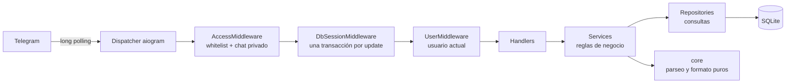
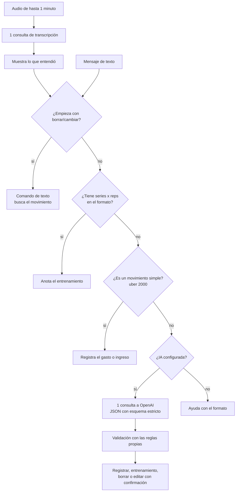
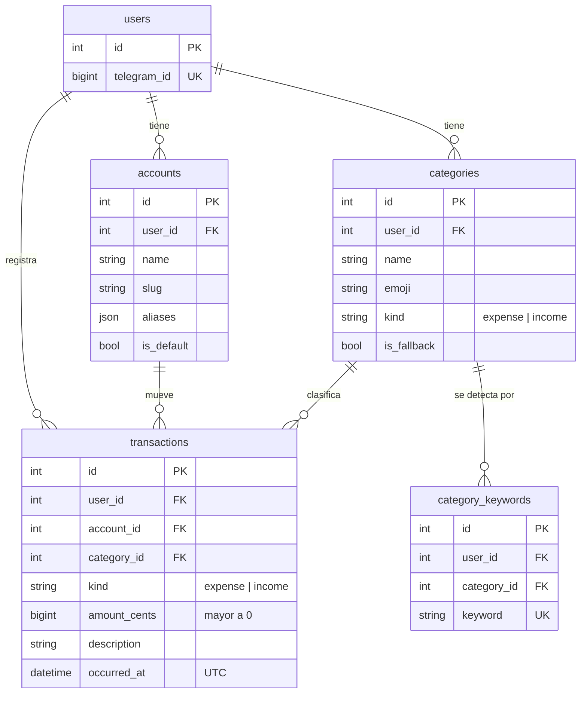
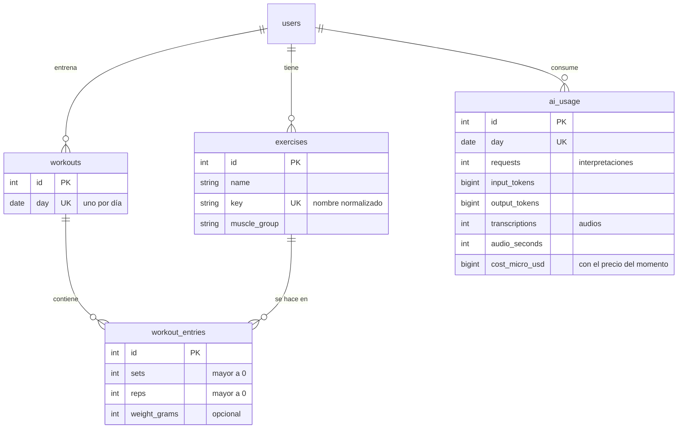

# Arquitectura

## Stack

| Pieza | Tecnología |
| ----- | ---------- |
| Lenguaje | Python 3.12 (compatible con 3.11) |
| Framework del bot | aiogram 3 (asyncio) |
| IA (opcional) | OpenAI `gpt-6-luna` con Structured Outputs y `gpt-4o-mini-transcribe` para audios (SDK oficial `openai`) |
| Base de datos | SQLite (modo WAL) vía `aiosqlite` |
| ORM y migraciones | SQLAlchemy 2 (async) + Alembic |
| Configuración | pydantic-settings |
| Dependencias | uv (`uv.lock` versionado) |
| Calidad | ruff, mypy `--strict`, pytest, pre-commit, gitleaks |
| Despliegue | Docker + Railway (volumen montado en `/data`) |

## Estructura

```text
src/asistente/
├── __main__.py            # python -m asistente
├── config.py              # Settings tipados desde variables de entorno
├── logging_config.py      # Logging con enmascarado de secretos
├── core/                  # Utilidades puras, sin I/O
│   ├── dates.py           # Zona horaria, meses en español, fechas relativas
│   ├── errors.py          # UserError: errores con mensaje apto para el usuario
│   ├── money.py           # Parseo y formato de pesos argentinos
│   └── text.py            # Normalización (minúsculas, sin acentos)
├── db/                    # Infraestructura de persistencia
│   ├── base.py            # DeclarativeBase, convenciones de nombres y mixins
│   ├── engine.py          # Engine async y PRAGMAs de SQLite
│   ├── registry.py        # Importa todos los modelos (para Alembic)
│   └── types.py           # UTCDateTime
├── users/                 # Dominio: usuarios
├── gym/                   # Dominio: gimnasio (modelos, parser 4x12, servicio)
├── ai/                    # IA opcional: intérprete, transcripción, precios, validación, uso
├── finance/               # Dominio: finanzas
│   ├── models.py          # Account, Category, CategoryKeyword, Transaction
│   ├── defaults.py        # Categorías, palabras clave y cuentas iniciales
│   ├── parser.py          # "uber 2000 ayer" → ParsedEntry
│   ├── matching.py        # Búsqueda de palabras clave
│   ├── repository.py      # Acceso a datos (consultas)
│   ├── service.py         # Reglas de negocio de los movimientos
│   ├── categories.py      # Categorías y palabras clave
│   └── reports.py         # Resumen mensual
└── bot/                   # Adaptador de Telegram
    ├── app.py             # Arma Bot + Dispatcher y arranca el polling
    ├── commands.py        # Menú de comandos
    ├── errors.py          # Respuesta ante errores (sin detalles internos)
    ├── help.py            # Texto de /ayuda, una sección por módulo
    ├── ui.py              # Editar o enviar mensajes, cortar textos largos
    ├── middlewares/       # Acceso, sesión de DB, usuario, reseteo de pasos
    └── handlers/          # Un paquete por dominio (common, finance, gym, ...)
        ├── free_text.py   # Ruteo del texto libre: comando, gimnasio, gasto o IA
        ├── voice.py       # Audios: los transcribe y siguen el camino del texto
        └── assistant.py   # Ejecuta lo que interpreta la IA (validado y confirmado)
migrations/                # Alembic
tests/                     # unit/ (lógica pura) e integration/ (DB + bot)
```

## Capas



- **Handlers**: solo traducen entre Telegram y los servicios (texto, botones y estados).
- **Services**: validan, aplican reglas y garantizan que cada operación sea del usuario actual.
- **Repositories**: consultas SQLAlchemy; no conocen Telegram.
- **core**: funciones puras y testeables sin base ni red.

Cada update se procesa dentro de una única transacción: si el handler falla, se hace rollback.

## Cómo se interpreta un mensaje



Las reglas resuelven gratis y al instante la gran mayoría de los mensajes. La IA nunca
ejecuta nada directamente: devuelve una intención que se valida (los importes tienen que
estar en el mensaje; fechas y números se re-parsean) y lo destructivo pide confirmación.

Un audio sigue el mismo camino: se transcribe con una consulta, el bot muestra lo que
entendió y lo procesa como si lo hubieras escrito. Antes, cada oración pasa a ser una
línea, así un entrenamiento dictado se separa en ejercicios igual que uno escrito.

## Modelo de datos (finanzas)



- Los importes se guardan en **centavos enteros** y siempre positivos; el tipo
  (`expense`/`income`) define el signo.
- Las fechas se guardan en **UTC**; los rangos de cada mes se calculan en hora de
  Buenos Aires y se convierten a UTC antes de consultar.
- Todas las consultas filtran por `user_id`: un `id` de movimiento ajeno, por ejemplo uno
  manipulado en un botón, no devuelve nada.

## Modelo de datos (gimnasio e IA)



## Seguridad

| Riesgo | Mitigación |
| ------ | ---------- |
| Que otra persona use el bot | `ALLOWED_USER_IDS` obligatorio; los updates de otros usuarios o de grupos se descartan sin responder |
| Filtración del token | Solo en variables de entorno (`.env` está en `.gitignore`), tipo `SecretStr`, enmascarado en logs y errores de validación ocultos |
| Secretos commiteados | `gitleaks` en pre-commit y en CI, más `detect-private-key` |
| Superficie de red | Long polling, sin puertos HTTP expuestos; la base es un archivo en el volumen, sin acceso remoto |
| Inyección SQL | Solo consultas parametrizadas de SQLAlchemy; `hide_parameters` en el engine |
| Manipulación de botones (IDOR) | Toda lectura o escritura valida que el registro pertenezca al usuario |
| Inyección de formato | Todo texto del usuario se escapa antes de enviarse en HTML |
| Contenedor | Imagen slim multi-stage, sin herramientas de build, el proceso corre como usuario sin privilegios |
| Dependencias | Versiones fijadas en `uv.lock` y Dependabot semanal |
| CI | Permisos mínimos (`contents: read`) y acciones fijadas por SHA |
| Respuestas de la IA | Esquema JSON estricto, valores re-validados con las reglas propias, importes que deben estar en el mensaje, confirmación para editar y borrar |
| Costo de la IA | Solo para lo que las reglas no entienden, tope diario en memoria (no lo saltea un rollback) que también cuenta los audios, salida limitada, timeout y costo real por consulta en `/ia` |
| Audios | Solo notas de voz de hasta 1 minuto y 1 MB, rechazadas antes de descargarlas; lo transcripto pasa por las mismas reglas y validaciones que un mensaje escrito |
| Privacidad con OpenAI | `store=false`, identificador de usuario hasheado, solo se envía el mensaje (o el audio) con categorías y nombres de ejercicios; el audio se procesa en memoria y no se guarda |
| Inyección de prompt | El mensaje va delimitado y sin `<` `>`; la IA no tiene herramientas ni puede ejecutar acciones |

## Despliegue en Railway

1. Crear un servicio desde el repositorio de GitHub; Railway detecta `railway.json` y
   construye con el `Dockerfile`.
2. Agregar un **Volume** montado en `/data`. Sin volumen, los datos se pierden en cada deploy.
3. Variables del servicio: `BOT_TOKEN`, `ALLOWED_USER_IDS` y, para la IA y los audios,
   `OPENAI_API_KEY`. La imagen ya usa `/data/asistente.db` como base.
4. Activar los backups automáticos del volumen.

Al arrancar, el contenedor:

1. Corre como root solo para darle la propiedad de `/data` al usuario `app`, porque
   Railway monta los volúmenes como root.
2. Baja privilegios al usuario `app`.
3. Aplica las migraciones (`alembic upgrade head`). No se usa el pre-deploy de Railway
   porque corre en otro contenedor que no monta el volumen.
4. Inicia el bot.

## Tests

- `tests/unit`: parseo de importes y fechas, parser de movimientos, configuración, logging
  y middlewares, sin I/O.
- `tests/integration`: servicios contra una base SQLite temporal, un test que verifica que
  las migraciones coinciden con los modelos (upgrade y downgrade) y flujos completos del bot
  con un `Bot` simulado que no hace llamadas a Telegram.
- La IA y la transcripción se prueban con el SDK real de OpenAI contra un transporte HTTP
  simulado: se verifica exactamente qué se envía, sin costo.
- Cualquier warning (por ejemplo, una deprecación) hace fallar los tests, para corregirlo
  apenas aparece.
- Cada commit pasa lint, tipos y tests por sí solo, así cualquier punto del historial
  es desplegable y `git bisect` funciona.
